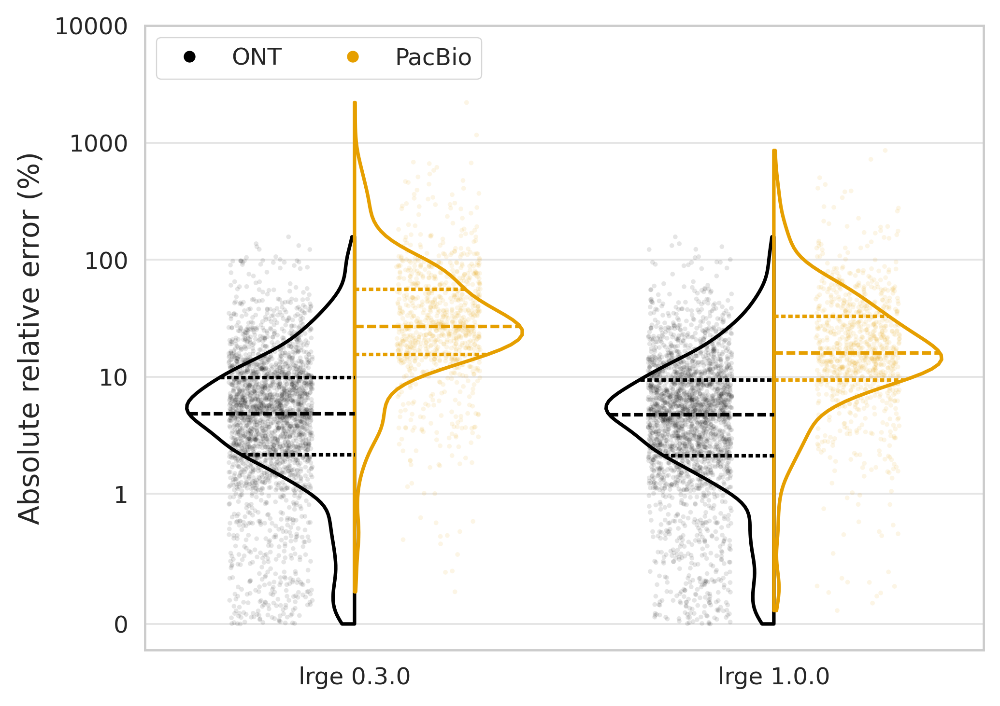
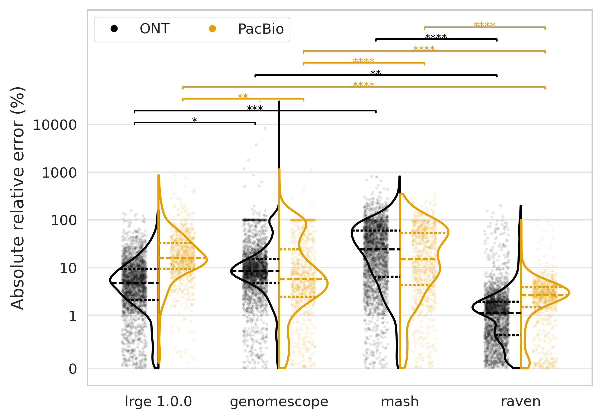
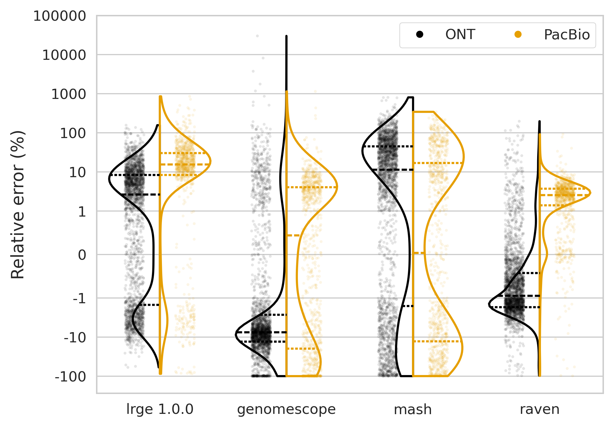
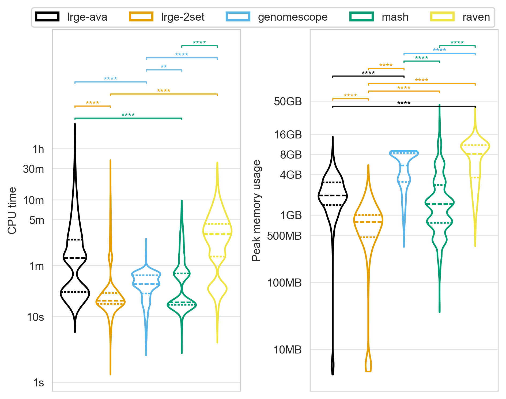

# LRGE

[](https://github.com/mbhall88/lrge/actions/workflows/check.yml)
[](https://github.com/mbhall88/lrge/actions/workflows/test.yml)
[][doi]

**L**ong **R**ead-based **G**enome size **E**stimation from overlaps

LRGE (pronounced "large") is a command line tool for estimating genome size from long read overlaps. It supports 
FASTQ, FASTA, and unaligned BAM, CRAM, and SAM formats. The tool is built 
on top of the [`liblrge`][liblrge] Rust library, which is also available as a standalone library for use in other projects.

> Michael B Hall, Chenxi Zhou, Lachlan J M Coin, Genome size estimation from long read overlaps, *Bioinformatics*, Volume 41, Issue 11, November 2025, btaf593, doi: [10.1093/bioinformatics/btaf593][doi]

## Table of Contents

- [Installation](#installation)
- [Usage](#usage)
- [What changed since the paper](#what-changed-since-the-paper)
- [Method](#method)
- [Results](#results)
- [Benchmark](#benchmark)
- [Alternatives](#alternatives)
- [Citation](#citation)
 

## Installation

- [Precompiled binary](#precompiled-binary)
- [Conda](#conda)
- [Cargo](#cargo)
- [Container](#container)
  - [Apptainer](#apptainer)
  - [Docker](#docker)
- [Build from source](#build-from-source)

### Precompiled binary


```shell
curl -sSL https://github.com/mbhall88/lrge/releases/latest/download/install.sh | sh
# or with wget
wget -nv -O - https://github.com/mbhall88/lrge/releases/latest/download/install.sh | sh
```

You can also pass options to the script like so

```
$ curl -sSL https://github.com/mbhall88/lrge/releases/latest/download/install.sh | sh -s -- --help
install.sh [option]

Fetch and install the latest version of lrge, if lrge is already
installed it will be updated to the latest version.

Options
        -V, --verbose
                Enable verbose output for the installer

        -d, --dry-run
                Display the actions that would be taken without performing them

        -f, -y, --force, --yes
                Skip the confirmation prompt during installation

        -p, --platform
                Override the platform identified by the installer [default: apple-darwin]

        -b, --bin-dir
                Override the bin installation directory [default: /usr/local/bin]

        -a, --arch
                Override the architecture identified by the installer [default: aarch64]

        -B, --base-url
                Override the base URL used for downloading releases [default: https://github.com/mbhall88/lrge/releases]

        -h, --help
                Display this help message
```

### Conda


```sh
conda install -c bioconda lrge
```

### Cargo


```sh
cargo install lrge
```

### Container

Docker images are hosted on the GitHub Container registry.

#### Apptainer

Prerequisite: [`apptainer`][apptainer] (previously Singularity)

```shell
$ URI="docker://ghcr.io/mbhall88/lrge:latest"
$ apptainer exec "$URI" lrge --help
```

The above will use the latest version. If you want to specify a version then use a
[tag][ghcr] like so.

```shell
$ VERSION="1.0.0"
$ URI="docker://ghcr.io/mbhall88/lrge:${VERSION}"
```

#### Docker

Prerequisite: [`docker`][docker]

```shell
$ docker pull ghcr.io/mbhall88/lrge:latest
$ docker run ghcr.io/mbhall88/lrge:latest lrge --help
```

You can find all the available tags [here][ghcr].

### Build from source

```shell
$ git clone https://github.com/mbhall88/lrge.git
$ cd lrge
$ cargo build --release
$ target/release/lrge -h
```

---

## Usage

> [!IMPORTANT]  
> The default values were calibrated from bacterial genomes, so you may need to adjust them if you are working with larger
genomes. See below for more details.

Estimate the genome size of a set of *Mycobacterium tuberculosis* ONT [reads](https://www.ebi.ac.uk/ena/browser/view/SRR28370649) 
([true genome size](https://www.ebi.ac.uk/ena/browser/view/CP149484): 4.40 Mbp / 4405449 bp).

```
$ wget -O reads.fq.gz "ftp://ftp.sra.ebi.ac.uk/vol1/fastq/SRR283/049/SRR28370649/SRR28370649_1.fastq.gz"
$ lrge -t 8 reads.fq.gz
[2026-09-08T02:06:13Z INFO  lrge] Running two-set strategy with 10000 target reads and 5000 query reads
[2026-09-08T02:06:28Z INFO  lrge] Estimated genome size: 4.44 Mbp (95% CI: 3.48 Mbp - 4.95 Mbp)
4437120
[2026-09-08T02:06:28Z INFO  lrge] Done!
```

The size estimate is printed to stdout, but you can also save it to a file with the `-o` flag.

```
$ lrge -t 8 reads.fq.gz -o size.txt
[2026-09-08T02:06:13Z INFO  lrge] Running two-set strategy with 10000 target reads and 5000 query reads
[2026-09-08T02:06:28Z INFO  lrge] Estimated genome size: 4.44 Mbp (95% CI: 3.48 Mbp - 4.95 Mbp)
[2026-09-08T02:06:28Z INFO  lrge] Done!
$ cat size.txt
4437120
```

By default, LRGE uses the [two-set strategy](#two-set-strategy) with 10,000 target reads (`-T`) and 5,000 query reads 
(`-Q`). You can use the [all-vs-all strategy](#all-vs-all-strategy) by specifying the number of reads to use with the `-n` flag.

In [the paper][doi], we ran LRGE on three eukaryotic genomes: *Arabidopsis thaliana* (125 Mbp), *Drosophila melanogaster* 
(143 Mbp), and *Saccharomyces cerevisiae* (12 Mbp). We used 50,000 query and 100,000 target reads for *A. thaliana* and 
*D. melanogaster*, and 10,000 query and 20,000 target reads for *S. cerevisiae*. For *H. sapiens* we used 100,000 query and 2,000,000 target reads.
As genome size increases, more reads are needed to obtain sufficient overlaps for accurate estimation. While there's no strict rule, 
we scaled the number of reads by the approximate order of magnitude difference between bacterial and eukaryotic genomes. 
LRGE's defaults are calibrated for bacteria, so multiplying these by the expected genome size ratio is a good starting point. 


### Library

You can also use the `liblrge` library in your Rust projects. This allows you to estimate genome size within your own 
applications - without needing to call out to `lrge`. For more details on how to use the library, see the [documentation](https://docs.rs/liblrge) or the 
[source code](./liblrge).

### Standard options

```
$ lrge -h
Genome size estimation from long read overlaps

Usage: lrge [OPTIONS] <INPUT>

Arguments:
  <INPUT>  Input FASTQ, FASTA, or unaligned BAM/CRAM/SAM file

Options:
  -o, --output <OUTPUT>             Output file for the estimate [default: -]
  -T, --target <INT>                Target number of reads to use (for two-set strategy; default) [default: 10000]
  -Q, --query <INT>                 Query number of reads to use (for two-set strategy; default) [default: 5000]
  -n, --num <INT>                   Number of reads to use (for all-vs-all strategy)
  -P, --platform <PLATFORM>         Sequencing platform of the reads [default: ont] [possible values: ont, pb]
      --normalize <MODE>            Control depth-aware read normalization [default: auto]
      --shortfall <MODE>            How to split an input too small to supply both read sets [scale, target] [default: scale]
  -F, --filter-contained[=<SHARE>]  Exclude internal matches above this share of a run's overlaps [default when given: 0.8]
  -t, --threads <INT>               Number of threads to use [default: 1]
  -C, --keep-temp                   Don't clean up temporary files
  -D, --temp <DIR>                  Temporary directory for storing intermediate files
  -s, --seed <INT>                  Random seed to use - making the estimate repeatable
  -q, --quiet...                    `-q` only show errors and warnings. `-qq` only show errors. `-qqq` shows nothing
  -v, --verbose...                  `-v` show debug output. `-vv` show trace output
  -h, --help                        Print help (see more with '--help')
  -V, --version                     Print version
```

### Full usage

Estimate genome size of PacBio reads. `-P` picks the minimap2 overlap preset and the interval
quantiles, so it is worth setting

```
$ lrge -P pb -t 8 reads.fq
```

Normalization runs when LRGE detects uneven read depth. Force it on or off with `--normalize`, and
see [Uneven read depth](#uneven-read-depth) for what it does

```
$ lrge --normalize never reads.fq
```

Cap the memory normalization spends buffering the reads it selects

```
$ lrge --max-read-buffer 512M reads.fq
```

An input too small to fill both read sets is divided between them in the ratio `-T` and `-Q` asked
for. To take the whole shortfall out of the target set, as versions up to v0.3.0 did

```
$ lrge --shortfall target reads.fq
```

Don't remove the intermediate read and overlap files

```
$ lrge -C reads.fq
```

Use the [all-vs-all strategy](#all-vs-all-strategy) with 10,000 reads

```
$ lrge -n 10000 reads.fq
```

Fix the seed so that subsequent runs return the same size estimate

```
$ lrge -s 123 reads.fq
```

By default, we take the median of the *finite* estimates to get the final genome size estimate. If you want to include 
infinite estimates in the calculation

```
$ lrge -8 reads.fq
```

If you don't want the estimate to be rounded to the nearest integer 🤓

```
$ lrge --float-my-boat reads.fq
```

The interval printed beside the estimate is a pair of percentiles of the per-read estimates, picked
per platform so that it covers the true size on 95% of the benchmark runs of that platform, and
labelled `95% CI` when it is that pair. See [The reported interval](#the-reported-interval). You can
use any pair you like, and a run given one names it in the output instead

```
$ lrge --q1 0.25 --q3 0.75 reads.fq
```

If you want to see the estimate for each read, turn on trace level logging

```
$ lrge -vv reads.fq
```

By default, the intermediate files are stored in a temporary directory. You can specify a different temporary 
directory

```
$ lrge -D ./mytemp/ reads.fq
```

If you have Illumina data, try GenomeScope2 or Mash (see [alternatives](#alternatives) for more details).

---

```
$ lrge --help
Genome size estimation from long read overlaps

Usage: lrge [OPTIONS] <INPUT>

Arguments:
  <INPUT>
          Input FASTQ, FASTA, or unaligned BAM/CRAM/SAM file

Options:
  -o, --output <OUTPUT>
          Output file for the estimate

          [default: -]

  -T, --target <INT>
          Target number of reads to use (for two-set strategy; default)

          [default: 10000]

  -Q, --query <INT>
          Query number of reads to use (for two-set strategy; default)

          [default: 5000]

  -n, --num <INT>
          Number of reads to use (for all-vs-all strategy)

  -P, --platform <PLATFORM>
          Sequencing platform of the reads

          [default: ont]
          [possible values: ont, pb]

      --normalize <MODE>
          Control depth-aware read normalization

          [default: auto]

      --shortfall <MODE>
          How to split an input too small to supply both read sets [scale, target]

          [default: scale]

  -F, --filter-contained[=<SHARE>]
          Exclude internal matches above this share of a run's overlaps [default when given: 0.8]

          An internal match is an alignment sitting in the middle of both reads with long unaligned tails either side, which is what two reads sharing a repeat look like. Excluding them can only raise an estimate, and on most inputs that is the wrong direction, so this is off unless asked for. Given as a bare -F, a run measures what share of its overlaps they account for and excludes them above the share fitted on the paper's benchmark, which is the highest among runs LRGE already sizes correctly, so that filtering disturbs none of them.

          That share is a starting point rather than a settled constant, so it can be given instead, written with an equals sign: -F=0.5 catches more repeat-driven runs at the cost of some correct ones, and -F=0 excludes every internal match whatever the share, which is what -F did before it had a threshold.

  -t, --threads <INT>
          Number of threads to use

          [default: 1]

  -C, --keep-temp
          Don't clean up temporary files

  -D, --temp <DIR>
          Temporary directory for storing intermediate files

  -s, --seed <INT>
          Random seed to use - making the estimate repeatable

  -8, --inf
          Take the estimate as the median of all estimates, *including infinite estimates*

  -f, --float-my-boat
          I neeeeeed that precision! Output the estimate as a floating point number

      --q1 <FLOAT>
          The lower quantile to use for the estimate

          The interval is read off the estimates the run made from its own reads, and the true size sits in a different part of that spread on each platform, so the default follows -P: 0.205 for nanopore and 0.01 for PacBio. Each pair is the narrowest covering the truth on 95% of that platform's runs in the paper's benchmark.

          [default: 0.205]

      --q3 <FLOAT>
          The upper quantile to use for the estimate

          The default follows -P, as --q1 does: 0.635 for nanopore and 0.615 for PacBio.

          [default: 0.635]

      --max-overhang-ratio <FLOAT>
          Maximum overhang size to alignment length ratio for internal overlap filtering

          This decides whether a single mapping is an internal match, where the share given to -F decides how many of them a run has to have. Only meaningful alongside -F/--filter-contained, which this option requires.

          [default: 0.2]

      --use-min-ref
          Use the smaller Q/T dataset as minimap2 reference (for two-set strategy)

      --max-read-buffer <SIZE>
          Cap on the memory used to buffer selected reads when normalizing (e.g. 512M, 1.5G)

          Above this, lrge buffers read positions and reads the input one extra time. The reads selected for a given seed are the same either way.

          [default: 1G]

  -q, --quiet...
          `-q` only show errors and warnings. `-qq` only show errors. `-qqq` shows nothing

  -v, --verbose...
          `-v` show debug output. `-vv` show trace output

  -h, --help
          Print help (see a summary with '-h')

  -V, --version
          Print version
```


## What changed since the paper

The [paper][doi] describes LRGE as it was before the 0.2 series, and the 0.3.x releases behave close
enough to it to reproduce its numbers: the paper's own per-accession two-set estimates and a 0.3.0
rerun of the same 3,370 read sets agree to a median of 0.75%. v1.0.0 does not. It changes the
estimate on some inputs and the reported interval on all of them, so its results are not comparable
with earlier versions. **Pin the 0.3.x series to reproduce the published results.**

Each change below was fitted or checked on the paper's own benchmark, and the sections linked from
the right-hand column carry the numbers.

| | what changed | where |
|---|---|---|
| `--normalize` | An input whose reads come mostly from one high-copy sequence used to collapse the estimate towards the size of that sequence. LRGE now detects depth skew and normalizes the read selection against it, by default. | [Uneven read depth](#uneven-read-depth) |
| `-F` | Overlaps that are really two reads sharing a repeat used to be either always dropped or never dropped. They are now measured on every run and dropped only above a share you set. | [Repeat-driven overlaps](#repeat-driven-overlaps) |
| `--q1`, `--q3` | The reported interval used to be one pair of percentiles for both platforms, covering 87% of the benchmark. It is now fitted per platform to cover 95%, and the nanopore interval is 18% narrower. | [The reported interval](#the-reported-interval) |
| `-P` | The flag was parsed and then ignored, so PacBio reads were overlapped with the nanopore preset. It now selects the preset, which moves the median PacBio estimate from 1.27 to 1.16 times the true size. | [The reported interval](#the-reported-interval) |
| `--shortfall` | An input too small to fill both read sets used to take the whole shortfall out of the target set, inverting the requested ratio. It is now divided in the ratio asked for. | [Two-set strategy](#two-set-strategy) |
| `--max-read-buffer` | Normalizing a large request on long reads could need more memory than the machine had. That buffer is now capped, with a second pass over the input as the fallback. | [Uneven read depth](#uneven-read-depth) |

Over the same 3,370 read sets the median absolute relative error falls from 7.1% to 6.4%, and the
runs landing within 10% of the truth rise from 58.6% to 62.9%. That splits cleanly by platform, and
by cause. On PacBio the median falls from 27.2% to 16.1% and the runs within 10% rise from 13.3% to
26.2%, all of it the `-P` fix: normalizing leaves the PacBio median at 27.2% while the preset is
still wrong. On nanopore the median falls from 4.84% to 4.77% and the runs within 10% rise from
75.1% to 76.4%, all of it normalization, which by design engages only on the inputs it finds skew
in.



The full working, including what was measured and rejected, is in
[`paper/corrections/`](./paper/corrections/): the depth-normalization constants and the `-F` share in
[`README_issue36.md`](./paper/corrections/README_issue36.md), the interval quantiles and the `-P` fix
in [`README_issue38.md`](./paper/corrections/README_issue38.md), and how the figures below were
redrawn on the same benchmark in
[`README_v1_results.md`](./paper/corrections/README_v1_results.md). The release notes are in
[`CHANGELOG.md`](./CHANGELOG.md).


## Method

The estimator itself is the [paper][doi]'s, and [Two-set strategy](#two-set-strategy) and
[All-vs-all strategy](#all-vs-all-strategy) below describe it. The three sections before them are
behaviour added after publication: what LRGE does about uneven read depth, about overlaps that come
from repeats, and how it picks the interval it prints beside the estimate.
[What changed since the paper](#what-changed-since-the-paper) is the short version of all three.

### Uneven read depth

LRGE assumes that sampled reads represent genome positions uniformly. A short plasmid or other
high-copy sequence can break this assumption by supplying most of the reads, even though it makes
up little of the genome. The resulting estimate may collapse towards the size of that sequence.

The default `--normalize auto` mode checks minimizer depth before selecting reads. When it detects
skew, it reduces the chance of retaining reads from high-depth sequence and draws both target and
query reads from the normalized pool. LRGE reports the skew score and retained read count at WARN
level so the depth-skewed input is not overlooked. Inputs without detected skew use the original
sampling path unchanged.

Detection itself is cheap: it draws minimizers from about one read in a hundred and skips the rest.
On an input too small for that to reach 500 reads it samples more, because below that the verdict
starts to turn on which reads happened to be drawn rather than on the input.
Building the full depth profile that normalization needs costs a second pass over the input, so LRGE
only takes that pass once it has decided to normalize. That pass and the scoring of every read
against the finished profile both use the thread count given to `--threads`. An input with no
detected skew therefore costs little more than `--normalize never`: over the 3,184 benchmark
accessions where the detector does not fire, `auto` runs at 1.02x the wall clock and 1.02x the peak
memory. Over the 186 where it does fire, the median is 1.09x, and 74 of them come out faster than
the same run unnormalized, because normalization leaves fewer reads to overlap. What normalizing
reliably does is shorten the tail: the slowest benchmark run takes 943 seconds unnormalized and 452
normalized.

Use `--normalize always` to normalize regardless of the skew verdict, or `--normalize never` to
disable both detection and normalization. Forcing normalization still runs detection, because the
depth a profile normalizes against is measured over the minimizers detection samples. A sample
drawn from every read instead would be mostly sequencing error seen in one read only, and its
median would be the noise floor of the sketch rather than the input's coverage depth.

Thin coverage does not hold normalization back. A shallow input gives a low median depth to
normalize against, and at a median of one a read is kept or dropped on its own count coming out as
two rather than three. Six skewed inputs with known genome sizes were subsampled until the median
depth fell through three, two and one to see what that costs. Across the 46 resulting inputs,
taking the median of three seeds each, `auto` landed at 0.64x to 0.99x of the true size and
`--normalize never` at 0.004x to 0.24x; `auto` was nearer on every one of them. An even-depth
input at the same median depth is still not called skewed, so shallow coverage on its own does not
trigger normalization.

Both numbers this rests on, the skew score an input must reach and the multiple of median depth
reads are kept down to, were then fitted on the paper's whole benchmark rather than left where
argument had put them. All 3,370 accessions were rebuilt from ENA and estimated against every
combination of skew threshold and retention multiplier. Normalizing is what moves the result: it
takes the mean |log2| error over the benchmark from 0.237 to 0.219, and the runs estimating under
half their true size from 25 to 13, of which 11 come back to within 10% of the truth. Where the two
constants sit inside a wide plateau does not move it, so both were left where they were. The
procedure, the tables, and the one place the benchmark and the low-depth inputs disagree are in
[`paper/corrections/README_issue36.md`](paper/corrections/README_issue36.md).

Thirteen runs still estimate under half their true size, and depth normalization is not the
mechanism that will fix them. Nine keep more than 90% of their reads through normalization, so
there is almost nothing for it to remove, and on eight of those raven lands within 5% of the truth
from the same reads. Two are thin enough that genomescope and raven miss them as badly as LRGE
does. One run, `SRR13009132`, is made worse: normalization drops 79% of its reads and takes it from
0.66x to 0.48x.

A wide reported interval means the per-read estimates disagree. Uneven depth is one possible cause;
repeats, sparse overlaps, or too few sampled reads can also widen it. Repeats have their own correction, below.

Normalization holds the reads it selects in memory until sampling finishes, which for a large
request on long reads can be more memory than a machine has. `--max-read-buffer` caps that buffer,
1 GB by default. The cap covers the selected reads and nothing else; scoring reads against the
profile keeps a couple of megabytes of reads per thread in transit, which sits outside it. A request
projected to need more than the cap is served by a path that buffers read positions instead of read
sequences, then reads the input a second time to write them out: less memory, one extra pass. Both
paths pick the same reads for a given seed, so the cap changes what a run costs while the estimate
stays the same. The projection comes from the mean read length, so a run can
still buffer past the cap; when it does, it says so and by how much.

### Repeat-driven overlaps

Depth normalization corrects an input whose reads come disproportionately from one part of the
genome. It cannot correct an input whose *overlaps* come disproportionately from repeats. Two reads
carrying the same repeat align over it with long unaligned tails hanging off either end, which is
nothing like the end-to-end overlap two reads from the same locus make. An estimate divides the
target count by the read's overlap count, so counting those alignments as overlaps drives the
estimate down, and on a repeat-rich input it drives it down several fold.

`-F/--filter-contained` drops them, and is off by default. A run given it measures what share of its
overlaps internal matches account for during the pass that collects them, and drops them only above
a share it can be given: bare `-F` uses 0.8, and `-F=0.5` or `-F=0` set it. Both counts come out of
the one pass, so the measuring costs nothing: over the whole benchmark a run carrying both has a
median wall clock and peak memory of 1.00x of one carrying a single count.

The default is off, and the benchmark is why. Over its 3,370 accessions the internal-match share
turns out to mark repeat-rich genomes rather than underestimated ones, and repeat-rich genomes
already read *high*: going from the lowest decile of the share to the highest, the median estimate
climbs from 0.995x of the truth to 1.245x, and the runs landing within 10% fall from 319 in 337 to
82 in 337. So filtering on a high share usually makes an overestimate worse. At 0.8 the flag fires
on 30 of the 3,370, and while 8 of those were reading low and 6 come back into the band, the other
22 were already reading high and every one is pushed further out.

| | within 10% of the truth | under half the true size | mean \|log2\| error |
|---|---|---|---|
| no `-F` (the default) | 2006 | 13 | 0.2195 |
| `-F` | 2012 | 6 | 0.2286 |
| `-F=0` | 814 | 1 | 0.5045 |

That is the trade `-F` offers: it halves the runs that estimate under half their true size and
disturbs no run that was already correct, and it pays for that with a slightly worse error overall.
Reach for it when an estimate looks far too low on a genome you have reason to think is repeat-rich.
`-vv` reports the share on every run, whether or not the flag is given, so one ordinary run tells
you where an input sits before you decide:

```
Overlap composition: internal matches account for 92.8% of 386290 overlaps
```

The share is a starting point rather than a settled constant, which is why `-F` takes one. The
default is where it is because 0.796 is the highest share among benchmark runs the estimator already
sizes correctly, so 0.8 is the first value that leaves all of them alone. Lowering it catches more
repeat-driven runs and starts costing correct ones; `-F=0` drops every internal match whatever the
run looks like, which is what `-F` did before it had a share and is the worst of the three rows
above. The equals sign is required, so that a bare `-F` cannot swallow the argument after it. The
measurements are in
[`paper/corrections/README_issue36.md`](paper/corrections/README_issue36.md).

`--max-overhang-ratio` sets how much overhang makes a single alignment an internal match, where the
share given to `-F` sets how many of them a run has to have before they are dropped.

### The reported interval

The number beside the estimate is the median of the per-read estimates, and the interval either side
of it is two percentiles of the same spread. What that interval covers depends on where the true
size tends to sit among those per-read estimates, and that differs by platform: over the paper's
benchmark the true size sits at the 46th percentile of a median nanopore run's estimates and at the
29th of a median PacBio one.

The paper fitted one pair for both platforms, the 15th and 65th percentiles, and reported about 92%
coverage. Measured on the same benchmark now it covers 87.2%, which is 97.0% on nanopore and 60.2%
on PacBio. So there are now two pairs, each the narrowest that covers 95% of its own platform's runs:

| | pair | coverage | median width |
|---|---|---|---|
| nanopore | 20.5th and 63.5th | 95.2% over 2,468 runs | 0.35 |
| PacBio | 1st and 61.5th | 95.0% over 902 runs | 0.85 |

Widths are multiples of the true genome size, so the nanopore interval is 18% narrower than the one
0.3.0 reports. `--q1` and `--q3` take their defaults from `-P` and can be set to any pair; a run
given a pair of its own prints it as `q0.25-q0.75` rather than calling it a 95% interval, because an
arbitrary pair has no measured coverage.

The PacBio interval is the wider of the two because the point estimate still runs high there, at a
median of 1.16 times the true size against 1.03 for nanopore. Its lower bound is the first
percentile, which is about forty estimates in at the default read counts but falls between the two
smallest estimates a run makes at `-Q 100`, so read a small PacBio run's lower bound as the single
read's estimate it is.

Fitting PacBio at all needed a bug fixed first. Up to and including v0.3.0 the `lrge` binary parsed
`-P` and never passed it on, so PacBio reads were overlapped with the nanopore preset whatever the
flag said. Giving them the PacBio preset takes the median estimate from 1.27 to 1.16 times the true
size, the runs landing within 10% from 13.4% to 26.2%, and the runs over twice the true size from
10.4% to 4.5%. Library callers setting `Builder::platform` were never affected. The fit, the
controls and the tables are in
[`paper/corrections/README_issue38.md`](./paper/corrections/README_issue38.md).

### Two-set strategy

The two-set strategy is the default method used by LRGE. It involves randomly selecting a two distinct subsets of reads 
from the input. One subset is deemed the target set ($T$) and the other the query set ($Q$). Each read $q_i$ in $Q$ is overlapped 
against $T$ and a genome size ($\textbf{GS}$) estimate is generated for that read ($\textbf{GS}_{T,q_i}$). The estimate is calculated based on 
the number of overlaps of $q_i$ with reads in $T$ ($\lvert \textbf{ov}(T \setminus q_i,q_i \rvert$), according to the formula:

```math
\textbf{GS}_{T,q_i} \approx \lvert T \setminus q_i \rvert \frac{\ell_{q_i} + \overline{\ell}_{T \setminus q_i} - 2 \cdot \textbf{OT}}{\lvert \textbf{ov}(T \setminus q_i,q_i) \rvert}
```

where $\vert T \setminus q_i \vert$ is the total size of the target set minus the read $q_i$, $\ell_{q_i}$ is the length of read $q_i$, $\overline{\ell}_{T \setminus q_i}$ is 
the average length of reads in $T$ minus $q_i$, and $\textbf{OT}$ is the overlap threshold (minimum chain score in minimap2, which 
defaults to 100 for overlaps). See [the paper][doi] for more formal/rigorous definitions.

Ultimately, the genome size estimate is the median of the finite estimates for each read in $Q$.

We use this strategy as the default as it is the most computationally efficient and the accuracy is comparable to the 
all-vs-all strategy. We suggest a smaller number of query reads than target reads, as this will speed things up and as 
we take the median of the estimates, the number of query reads (over a certain point) should not affect the accuracy of 
the estimate all that much.

That asymmetry is why an input with fewer reads than the two sets ask for is divided between them in
the requested ratio, both sets shrinking together. An input of 7,473 reads asked for 10,000 target
and 5,000 query gives 4,982 and 2,491. Up to and including v0.3.0 the whole shortfall came out of
the target set, giving 2,473 and 5,000, so a request for twice as many target as query reads was
served with half as many. To see what that costs, a pool of about 7,500 reads from three accessions
with known genome sizes was divided five ways on three seeds each, from the split the old rule
produces through to eight target reads per query read. Taking the median of the three seeds, the old
rule landed at 0.010x, 0.156x and 0.209x of the true size on the three accessions, and the requested
2:1 at 0.081x, 0.268x and 0.247x. Those medians rise with the target's share at every step on all
three accessions. Seven of the nine individual seed series do the same throughout; the two that do
not each dip once and by little, 0.209x to 0.200x on SRR26715166 seed 42 and 0.385x to 0.361x on
DRR213976 seed 4556. From 1:1 onward the reported interval also narrows against the estimate, on
SRR12247681 from 90 times the estimate down to 1.9 times, so the higher estimates are the better
determined ones as well; the one step it widens on is the first, out of the old rule's split.

Splitting further toward the target than the request asked for helped further still on those three
accessions, all of which sit deep in the regime where the estimator is already failing. A wider
sweep has since put a boundary on that: 27 accessions with known genome sizes, three pool sizes and
both normalization modes, 2,328 runs in `paper/corrections/issue63_split_calibration.tsv`.

The split only matters when the pool is far below the request. With normalization on and a pool of
about 7,500 reads, the spread across splits is three times the spread across seeds, and pushing from
the requested 2:1 to 4:1 lands nearer the truth on 19 of the 27. At a pool of about 15,000, and on
the whole input, that spread falls to between one and two times the seed spread and the same
comparison comes out 13 of 23 and 11 of 23. Asking for 20,000 target reads against 5,000 query,
rather than dividing 15,000 differently, moves the median estimate by 0.002.

So the defaults stay where they are, and the shortfall rule keeps the ratio it was asked for rather
than leaning past it. What is left to gain is under half the seed-to-seed spread, it peaks at 4:1
and falls back at 8:1, and taking it would mean overriding an explicit `-Q`. Expected overlaps per
query read, the quantity the estimator depends on, does not predict where the split matters either:
its correlation with the gain from rebalancing is 0.28 where the pool is starved and under 0.13
everywhere else, so a floor on it would not be a better rule than a ratio.

Two limits on that. These accessions were collected for
[issue #29](https://github.com/mbhall88/lrge/issues/29) because they estimate badly, so they are not
a sample of ordinary inputs and the figures above are only meant as comparisons between splits
within one accession. They also span 2.2 Mbp to 11.1 Mbp and are all bacterial, while the read
counts in [the paper][doi] move from 2:1 for bacteria to 20:1 for *H. sapiens*, so none of this says
the split can be ignored at eukaryotic genome sizes.

Across the 17 benchmark accessions the change reaches only `SRR26715166`, the one input that cannot
supply 15,000 reads. Its estimate moves from 0.828x to 0.912x of the true size under
`--normalize auto`, and from 0.215x to 0.247x under `--normalize never`. Over 20 seeds the new rule
is nearer the truth on 19 and 16 of them respectively. The other 16 accessions reproduce to the base
pair. The estimate the paper reports for `SRR26715166` is therefore out of date.

Pass `--shortfall target` to take the whole shortfall from the target set as before. Sizing the sets
by number with `-T` and `-Q` is the more direct way to ask for a particular split, since the ratio
is preserved whatever it is: a deliberately query-heavy request stays query-heavy. An input with
fewer reads than the query request alone used to be an error, so LRGE refused to run on any input of
5,000 reads or fewer at the defaults; it is now divided like any other.

### All-vs-all strategy

The all-vs-all strategy involves overlapping some random subset (`-n`) of reads in the input against each other. The 
genome size estimate for each read is calculated as above.

This strategy is *generally* more computationally expensive than the two-set strategy, but it can be more accurate. Though 
we did not find the difference to be statistically significant in our tests.

## Results

We compared LRGE to three other methods: GenomeScope2, Mash, and Raven ([see below](#alternatives) for more info). We ran 
each method on 3370 read sets from PacBio or ONT data. Each of these samples is associated with a RefSeq assembly, so the 
true size was taken as the size of the RefSeq assembly. You can find the metadata for the samples [here](./paper/config/bacteria_lr_runs.filtered.tsv).

> [!NOTE]
> These figures are redrawn for v1.0.0 on the same 3,370 read sets. The LRGE column is v1.0.0; the
> other three methods are the [paper][doi]'s own numbers, unchanged. The published figures, which
> also carry the all-vs-all strategy, are in the paper itself and in this repository at the
> [`lrge-0.3.0`](https://github.com/mbhall88/lrge/blob/lrge-0.3.0/README.md#results) tag.
>
> LRGE's read sets were rebuilt from ENA for these runs rather than kept from the paper's. That does
> not move anything: 0.3.0 on the rebuilt reads reproduces the paper's own two-set figures, at a
> median absolute relative error of 4.84% against 4.84% on nanopore and 27.2% against 27.1% on
> PacBio. Per-accession estimates are in
> [`v1_estimates.tsv`](./paper/corrections/v1_estimates.tsv) and the summary in
> [`v1_method_accuracy.tsv`](./paper/corrections/v1_method_accuracy.tsv).

The full results are available in the [paper][doi] and [here](./paper/results/estimates/estimates.tsv). Here is a brief summary of how LRGE compares to other methods.



| | median absolute relative error | within 10% of the truth |
|---|---|---|
| LRGE, nanopore | 4.8% | 76.4% |
| LRGE, PacBio | 16.1% | 26.2% |
| GenomeScope2 | 8.5% / 5.8% | 57.6% / 62.9% |
| Mash | 24.0% / 15.1% | 32.5% / 41.9% |
| Raven | 1.1% / 2.6% | 96.4% / 97.6% |

Where two numbers are given they are nanopore and PacBio. Raven assembles the reads, which is both
why it is the most accurate here and why it is far and away the most expensive; see
[Benchmark](#benchmark).

This compares the absolute relative error as a percentage. The relative error ($\epsilon_{\text{rel}}$) is calculated as:

```math
    \epsilon_{\text{rel}} = \frac{\hat{G} - G}{G} \cdot 100
```

where $G$ is the true genome size, and $\hat{G}$ is the estimated genome size. For example, a $\epsilon_{\text{rel}}$ of 50% 
is out (higher or lower) by 50% of the true genome size. So if the true genome size is 1 Mbp, a $\epsilon_{\text{rel}}$ of 50% 
would be 1.5 Mbp or 0.5 Mbp. 

The following figure shows the (non-absolute) relative error for the same methods to give an 
indication of which methods tend to over or underestimate.




## Benchmark

For the full details of the methods benchmarked, see the [paper][doi]. However, here is a brief summary of the results.

> [!NOTE]
> This figure is the [paper][doi]'s and has not been redrawn for v1.0.0. Time and memory are
> properties of the machine as much as the tool, and the v1.0.0 runs were made on different
> hardware, so putting them beside the paper's measurements of the other three methods would compare
> the clusters rather than the methods. What v1.0.0 costs against v0.3.0, measured on one machine, is
> in [Uneven read depth](#uneven-read-depth).



The statistical annotations above the violins are coloured by the method which has the lowest mean value for the given 
metric.

## Alternatives

The methods we compare against are:

[GenomeScope2](https://github.com/tbenavi1/genomescope2.0): to get estimates from GenomeScope2, you need to first generate 
a k-mer spectrum. We used [KMC](https://github.com/refresh-bio/KMC) for this. You can find a Python script that takes 
reads, generates a k-mer spectrum, and estimates genome size in [`genomescope.py`](./paper/workflow/scripts/genomescope.py). The list of parameters used 
can also be found in the [workflow config](./paper/config/config.yaml).

[Mash](https://github.com/marbl/Mash): we used `mash sketch` on the reads, which prints out the estimated genome size in 
the logging output. You can find the options used in the [workflow config](./paper/config/config.yaml).

[Raven](https://github.com/lbcb-sci/raven): Raven essentially just assembles the reads - *REALLLLY* fast 🚀

You can find the full details of how we compared methods in the [workflow](./paper/workflow/rules/estimate.smk).

## Citation

If you use LRGE in your research, please cite the following [paper][doi]:

```bibtex

@article{hall_genome_2025,
	title = {Genome size estimation from long read overlaps},
	volume = {41},
	issn = {1367-4811},
	url = {https://doi.org/10.1093/bioinformatics/btaf593},
	doi = {10.1093/bioinformatics/btaf593},
	number = {11},
	journal = {Bioinformatics},
	author = {Hall, Michael B and Zhou, Chenxi and Coin, Lachlan J M},
	month = nov,
	year = {2025},
	pages = {btaf593},
}

```

[apptainer]: https://github.com/apptainer/apptainer
[docker]: https://docs.docker.com/
[doi]: https://doi.org/10.1093/bioinformatics/btaf593
[ghcr]: https://github.com/mbhall88/lrge/pkgs/container/lrge
[liblrge]: https://docs.rs/liblrge
